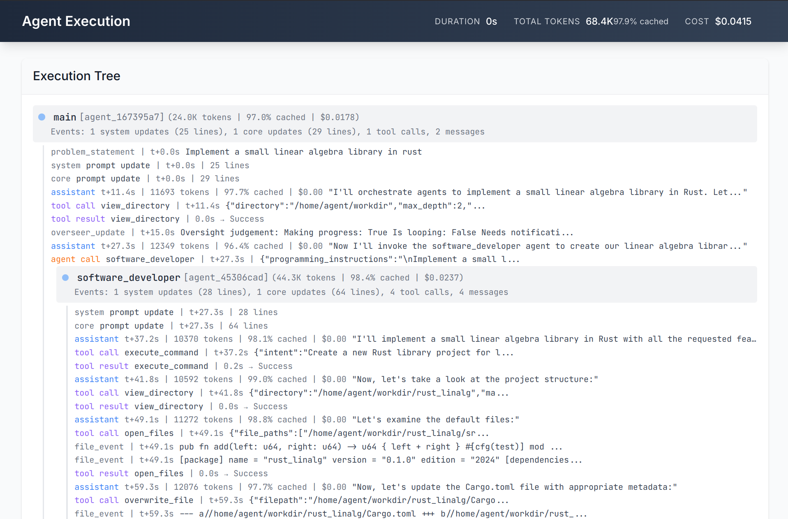

<p align="center">
  <h1 align="center">Self-Improving Coding Agent</h1>
  <p align="center">A coding agent experiment, that works on its own codebase.</p>
  <p align="center">
    
  </p>
</p>

The system operates as an iterative improvement loop:
1. evaluating the current agent version on some benchmark tasks to capture how well it does
2. storing the results in an archive
3. running the agent on its own codebase to work on an improvement
4. going back to step 1 with the updated agent code

See [our workshop paper](https://openreview.net/pdf?id=rShJCyLsOr) for more details.

## Quickstart

> IMPORTANT NOTE: always run the agent in the provided Docker container. Since the agent can execute shell commands, this offers some isolation from your host machine, avoiding inadvertent file system manipulation and similar risks.

First, make sure you've cloned the repo
```bash
git clone https://github.com/MaximeRobeyns/self_improving_coding_agent
```

Then, export some environment variables which will be made available in the
docker container. The project supports inference from a number of providers to
allow for experimentation across many models. You must export at least one of
these in your _local_ shell, which you can do either directly or with `direnv`,
`dotenv`, etc. Omitting any provider key will simply make that provider's
models unavailable to the agent.

```bash
export ANTHROPIC_API_KEY=  # For Claude models
export OPENAI_API_KEY=  # For GPT 4o and reasoning models (o1, o3, etc)
export GEMINI_API_KEY=  # For Gemini models
export VERTEX_PROJECT_ID=  # For models hosted on GCP's Vertex
export FIREWORKS_AI_API_KEY=  # For DeepSeek / Llama hosted on fireworks
export DEEPSEEK_API_KEY=  # For DeepSeek direct inference (V3, R1)
export MODAL_TOKEN_ID=  # To allow the agent to visit webpages and read papers
export MODAL_TOKEN_SECRET=  # To allow the agent to visit webpages and read papers
```
For gemini, you should replace the template file in `sandbox/GOOGLE_APPLICATION_CREDENTIALS.json` with your own credentials.

Once you have at least one LLM provider's API key exported, you can build the docker image. The build command is wrapped in a Makefile target for convenience:

```bash
make image
```

If you are using an apple silicon machine, use this target instead:
```
make image-mac
```

Finally, install the requirements in your local python environment:
```bash
# remember to activate a virtual environment or equivalent here
pip install -r base_agent/requirements.txt
pip install swebench
```

### Testing the Agent

To test if the setup was successful, you can run the agent interactively with a manually set initial prompt using this target
```bash
make int
```
This will start the docker container and attach your shell to it. You can then run
```bash
python -m agent_code.agent --server true -p "<some initial request here>"
```
Then open your browser on http://localhost:8080 to follow the agent execution. This will show you an interactive webpage which visualises the events in the event bus / the agent callgraph, allowing you to click on individual events to see them in more detail, read overseer messages, and collapse sub-agent traces.



The agent's working directory is mapped to `results/interactive_output` and any files created will be available here on your machine. Agent logs will be in `results/interactive_output/agent_output`.

You can see more options by doing
```bash
make help
```
or agent arguments wit
```bash
python -m base_agent.agent --help
```

To further configure the agent, including the choice of LLMs, edit `base_agent/src/config.py`.

## Self-Improvement Loop

To run the self-improvement loop, first inspect the list of benchmarks in the `base_agent/src/benchmarks/__init__.py` file, and make sure that you have uncommented those you want to include. Then do
```bash
python runner.py
```
To see all the options, do
```bash
python runner.py --help
```
Common options might be
```bash
python runner.py --id 1 --workers 6
```

This will start the agent loop, placing the results in `results/run_<id>`.

## Things to work on

Here are some potential things to try and do with the agent framework:

- [ ] get the agent to curate / build more of its own benchmarks
- [ ] reduce the variance of self-improvement runs (early features often influence subsequent features)
- [ ] use a stronger LLM to build a scaffold for a weaker LLM
- [ ] find or create more realistic 'software engineering' benchmark tasks

## Agent Description

The agent in `base_agent` is a minimal agent that can just about perform the
meta-improvement task. It lacks efficient file editing tools, devtools such as
tree sitter or LSP integrations, or advanced reasoning structures that would
help it out when performing coding tasks. It has the necessary building blocks
to bootstrap these features and specialise itself to the distribution of
benchmark tasks included.

Please see `base_agent/README.md` for a more detailed discussion of the base agent framework.

```
├── base_agent
│   ├── agent_change_log.md
│   ├── agent.py
│   ├── conftest.py
│   ├── description.txt
│   ├── __main__.py
│   ├── pytest.ini
│   ├── README.md
│   ├── requirements.txt
│   ├── src
│   │   ├── agents
│   │   ├── benchmarks
│   │   ├── callgraph
│   │   ├── config.py
│   │   ├── events
│   │   ├── __init__.py
│   │   ├── llm
│   │   ├── oversight
│   │   ├── schemas
│   │   ├── tools
│   │   ├── types
│   │   ├── utils
│   │   └── web_server
│   └── tests
│       ├── agents
│       ├── benchmarks
│       ├── events
│       ├── __pycache__
│       ├── test_example.py
│       ├── tools
│       └── utils
├── benchmark_data
├── results
│   ├── run_<id>
│   └── interactive_output
├── runner.py
└── sandbox
```

### Results Organization

```
results/run_{id}/
├── metadata.json          # Experiment metadata
└── agent_{i}/             # Agent iteration directory
    ├── agent_code/        # Agent implementation
    ├── benchmarks/        # Benchmark results
    │   └── {bench_name}/
    │       ├── results.jsonl  # Per-problem results
    │       ├── perf.jsonl     # Summary metrics
    │       └── traces/        # Detailed traces
    └── meta_improvement/  # Improvement logs
```

## Citation

```
@inproceedings{
    robeyns2025sica,
    title={{SICA} A Self-Improving Coding Agent},
    author={Maxime Robeyns, Martin Szummer, and Laurence Aitchison},
    booktitle={ICLR 2025 Workshop on Scaling Self-Improving Foundation Models},
    year={2025},
    url={https://openreview.net/forum?id=rShJCyLsOr}
}
```
